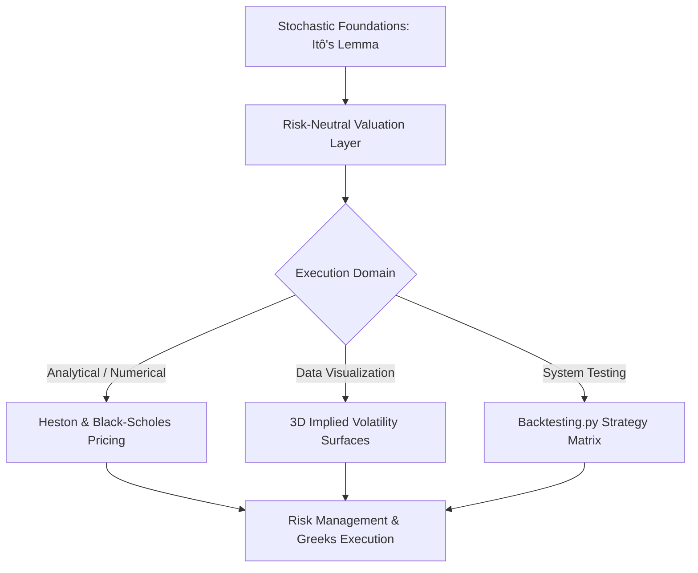

# 📈 Quantitative Finance & Stochastic Calculus Engine

[](https://github.com/Vipeen21)
[](https://github.com/Vipeen21/Quant-finance/stargazers)
[](https://github.com/Vipeen21/Quant-finance/network/members)
[](https://github.com/Vipeen21/Quant-finance/blob/main/LICENSE)

<p align="left">
  
  
  
  
  
</p>

This repository bridges the gap between high-level stochastic calculus theory and practical algorithmic execution. It features interactive implementations covering everything from classical risk-neutral pricing frameworks to complex, non-constant volatility regimes.

---

## 🎯 Flagship Frameworks

### 1. Stochastic Volatility & The Heston Model
Real-world asset returns exhibit volatility clustering and leverage effects that the classical Black-Scholes model fails to capture. This framework models market dynamics using two coupled Stochastic Differential Equations (SDEs):

$$dS_t = \mu S_t dt + \sqrt{\nu_t} S_t dW_{1,t}$$

$$d\nu_t = \kappa(\theta - \nu_t) dt + \sigma \sqrt{\nu_t} dW_{2,t}$$

* **Calibration Layer:** Fits structural parameters ($\kappa, \theta, \sigma, \rho$) to empirical market option chains.
* **Pricing Engine:** Solves the characteristic function to value European derivatives under stochastic regimes.

### 2. Implied Volatility Surfaces & Numerical Methods
* **Volatility Surfaces:** Generates dynamic 3D visualizations mapping the continuous implied volatility smile and skew across varying strikes and maturities.
* **Finite Difference Methods (FDM):** Solves the Black-Scholes partial differential equations (PDEs) numerically to value path-dependent and exotic options.

---

## 🏗️ Quantitative Architecture & System Workflow

The workspace decouples mathematical foundation layers from live asset analysis and algorithmic strategy testing:



---

## 📊 Algorithmic Matrix & Methodology Spectrum

| Model / Methodology | Mathematical Engine | Primary Use Case | Market Advantage |
| --- | --- | --- | --- |
| **Heston Model** | Square-root Diffusion SDEs | Pricing under stochastic volatility | Captures volatility smiles, skews, and empirical asset distribution tail behavior. |
| **Black-Scholes** | Geometric Brownian Motion | Classical option valuation & Greeks | Establishes exact baseline analytical solutions for risk-neutral pricing benchmarks. |
| **Finite Differences** | Implicit/Explicit PDE Solvers | Exotic & path-dependent options | Handles complex boundary conditions where closed-form solutions do not exist. |
| **Backtesting Engine** | Event-Driven Vectorization | Systematic strategy validation | Quantifies historical performance, drawdowns, and Sharpe ratios before deployment. |

---

## 📂 Repository Blueprint

```text
├── getting_started_tutorials/       # Core introductory notebooks for stochastic calculus
├── Heston Pricing 1.ipynb           # Stochastic Volatility calibration pipelines
├── Heston Pricing 2.ipynb           # Advanced pricing simulations under Heston regimes
├── the_implied_volatility_surface.ipynb # 3D mapping of market volatility smiles and skews
├── finite_differences_option_pricing.ipynb # Numerical PDE solvers for option values
├── Black-ScholesTrading.ipynb       # Application of baseline analytic pricing models
├── itos_lemma.ipynb                 # Mathematical proofs and foundational stochastic calculus
├── ito_integration.ipynb            # Numerical integration of stochastic paths
├── algo trading with backtesting.py # Automated, vector-based backtesting logic
└── algo-trading_using_alpaca_api.py # Production broker infrastructure wiring

```

---

## ⚡ Quick Start & Setup

Clone the system and spin up the quantitative analysis notebooks locally in under two minutes:

```bash
# 1. Clone the repository
git clone [https://github.com/Vipeen21/Quant-finance.git](https://github.com/Vipeen21/Quant-finance.git)
cd Quant-finance

# 2. Install production-validated mathematics dependencies
pip install numpy scipy pandas matplotlib seaborn backtesting alpaca-trade-api

# 3. Launch the analytical workspace
jupyter notebook

```

---

## 🔮 Future Roadmap & Scalability Matrix

* [ ] **Local Volatility Inversion:** Implement the Dupire Equation to extract deterministic local volatility surfaces directly from market options.
* [ ] **Deep Hedging Fields:** Train neural network models to execute optimal discrete-time delta hedging under transaction costs.
* [ ] **GPU Acceleration:** Port the finite difference grid solvers to PyTorch/CUDA to scale multi-asset option matrices.

---

## 🤝 Connect & Collaborate

If this repository assists your quantitative research, trading strategy formulation, or stochastic calculus foundations, **consider giving it a star!** ⭐

* **Author:** Vipeen Kumar
* **LinkedIn:** [Profile Link](https://www.google.com/search?q=https://linkedin.com/in/vipeen-kumar-908212b8)
* **Portfolio Website:** [vipeen21.github.io](https://www.google.com/search?q=https://vipeen21.github.io)

`#QuantitativeFinance` `#StochasticCalculus` `#HestonModel` `#AlgorithmicTrading` `#VolatilitySurface` `#OptionsPricing`
