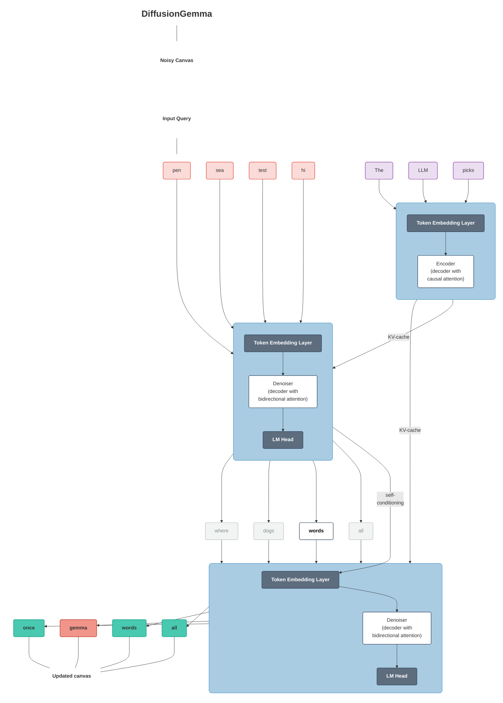
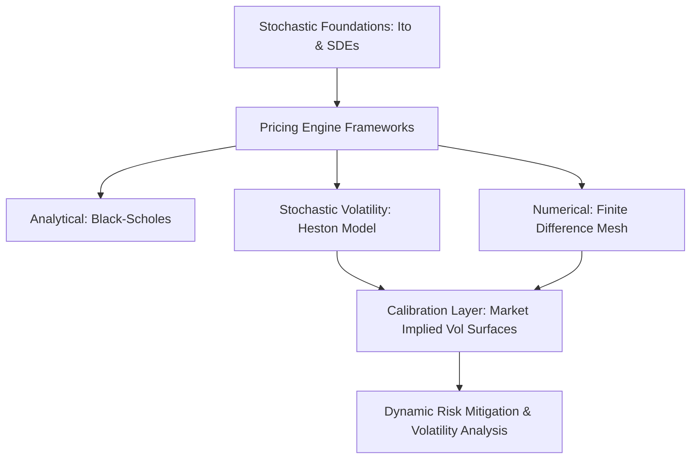

# 📈 Quantitative Finance & Stochastic Calculus Engine

[](https://github.com/Vipeen21)
[](https://github.com/Vipeen21/Quant-finance/stargazers)
[](https://github.com/Vipeen21/Quant-finance/network/members)
[](https://github.com/Vipeen21/Quant-finance/blob/main/LICENSE)


<p align="left">
  
  
  
  
  
</p>

This repository bridges the gap between high-level stochastic calculus theory and practical computational execution. It features interactive implementations covering everything from classical risk-neutral pricing frameworks to complex, non-constant volatility regimes and mathematical integration foundations.

---

## 🏗️ Engine Architecture & Mathematical Workflow

The core framework decouples foundational stochastic calculus elements from numerical layers and empirical calibration matrices to map complex asset profiles dynamically.






---

## 🎯 Core Frameworks Breakdown

### 1. Stochastic Volatility & The Heston Model

Real-world asset returns exhibit volatility clustering and leverage effects that classical constant-volatility frameworks fail to capture. This engine models asset dynamics via two coupled Stochastic Differential Equations (SDEs):

$$dS_t = \mu S_t dt + \sqrt{\nu_t} S_t dW_{1,t}$$

$$d\nu_t = \kappa(\theta - \nu_t) dt + \sigma \sqrt{\nu_t} dW_{2,t}$$

* **Calibration Layer:** Mathematically fits structural parameters ($\kappa, \theta, \sigma, \rho$) to empirical market option chains.
* **Pricing Engine:** Evaluates the characteristic function via Fourier inversions to value European derivatives under non-constant volatility.

### 2. Implied Volatility Surfaces & Numerical Discretization

* **Volatility Surfaces:** Generates dynamic, multi-dimensional structures mapping the continuous implied volatility smile and skew across varying strikes and maturities.
* **Finite Difference Methods:** Complements analytical equations by numerically solving pricing Partial Differential Equations (PDEs) under discrete boundary conditions.

---

## 📊 Comparative Framework Analysis

| Model Framework | Volatility Assumption | Solution Method | Key Strength | Ideal Use-Case |
| --- | --- | --- | --- | --- |
| **Black-Scholes** | Constant $\sigma$ | Analytical (Closed-form) | Speed & benchmark stability | Plain-vanilla liquid options |
| **Heston Model** | Stochastic $\nu_t$ (CIR Process) | Semi-Analytical (Fourier) | Captures smile, skew & leverage | Long-dated options, exotic profiles |
| **Finite Differences** | Flexible / Arbitrary | Numerical (Grid/Mesh) | Handles path-dependence & barriers | American options, custom boundaries |

---

## 📂 Repository Blueprint

```bash
├── getting_started_tutorials/     # Foundational concepts & entry points
├── Black-ScholesTrading.ipynb     # Closed-form pricing & basic Greeks infrastructure
├── Heston Pricing 1.ipynb         # SDE setup and characteristic function solving
├── Heston Pricing 2.ipynb         # Fourier inversions and parameters calibration
├── finite_differences_option_pricing.ipynb # PDE numerical mesh methods
├── the_implied_volatility_surface.ipynb    # 3D mapping of skew and smile curves
├── ito_integration.ipynb          # Computational notebooks on Ito's Integral
├── itos_lemma.ipynb               # Structural expansions of stochastic variables
├── market implied volatility.py   # Real-time asset implied volatility extraction
├── risk free option trading.py    # Arbitrage boundary verification scripts
└── LICENSE                        # Open-source distribution permissions

```

---

## 🗺️ Future Roadmap & Expansion Work

* [x] Implement core Ito Calculus & SDE simulation environments.
* [x] Build semi-analytical closed-form frameworks (Black-Scholes, Heston).
* [x] Launch 3D Implied Volatility Surface mapping toolsets.
* [ ] **Phase 4: Neural Volatility Operators:** Integrate Physics-Informed Neural Networks (PINNs) to accelerate option PDE grid solving under tight latency limits.
* [ ] **Phase 5: Rough Volatility Frameworks:** Implement fractional Brownian motion (e.g., Rough Heston, rBergomi) to address structural micro-market irregularities.
* [ ] **Phase 6: Advanced Calibration Optimization:** Deploy hybrid genetic-gradient algorithms to resolve non-convex objective spaces during Heston parameter fitting.

---

## 🤝 Community & Contribution

Whether you are looking to fix a mathematical edge-case, optimize a matrix calculation in NumPy, or add a new stochastic asset path generator, contributions are highly welcome!

1. **Fork** the project repository.
2. **Create** your feature branch (`git checkout -b feature/StochasticUpgrade`).
3. **Commit** your changes (`git commit -m 'Add neural network calibration layer'`).
4. **Push** to the branch (`git push origin feature/StochasticUpgrade`).
5. Open a **Pull Request**.

## 🙏 Connect & Collaborate

If this repository assists your quantitative research, trading strategy formulation, or stochastic calculus foundations, **consider giving it a star!** ⭐
[⭐ Star This Repo](https://github.com/Vipeen21/Quant-finance/stargazers) | [🍴 Fork This Repo](https://github.com/Vipeen21/Quant-finance/network/members)

**Vipeen Kumar** *Quantitative Researcher & Data Scientist*

Let's collaborate on quantitative finance, stochastic systems, and financial AI architecture.

* **Author:** Vipeen Kumar 
* **LinkedIn:** [Profile Link](https://www.google.com/search?q=https://linkedin.com/in/vipeen-kumar-908212b8)
* **Portfolio Website:** [vipeen21.github.io](https://www.google.com/search?q=https://vipeen21.github.io)

`#QuantitativeFinance` `#StochasticCalculus` `#HestonModel` `#AlgorithmicTrading` `#VolatilitySurface` `#OptionsPricing`
